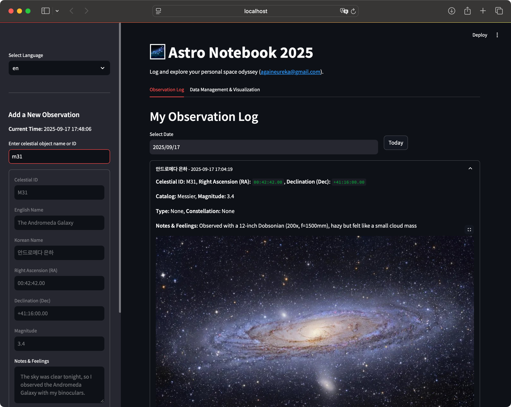

# Astro Notebook

- Astro Voyager : A convenient and easy stargazing notebook for all of us
- JPark(againeureka), Sep. 2025 (with Gemini 2.5 Flash and ChatGPT 5o)
- git@github.com:againeureka/astro_notebook.git

## Raw catalogue source

- SimpleMessier : https://github.com/WaylonGao/simpleMessier
- BSC5P-JSON : https://github.com/frostoven/BSC5P-JSON

## How to run

```bash
$ python3 -m venv venv
$ source venv/bin/activate
$ bash install.sh

$ streamlit run app.py
or
$ bash run.sh

```

## Demo pages



