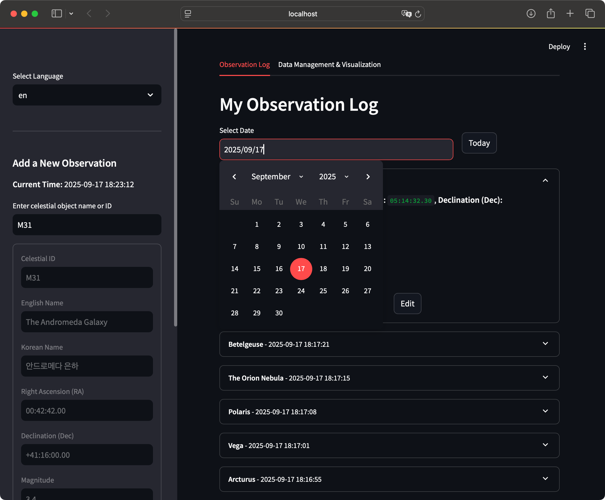

# Astro Notebook

- An easy and reliable stargazing notebook(logbook) for all of us
- JPark(againeureka), Sep. 2025 (with Gemini 2.5 Flash and ChatGPT 5o)
- git@github.com:againeureka/astro_notebook.git

## Demo pages




## Raw source data for search

- SimpleMessier : https://github.com/WaylonGao/simpleMessier
- BSC5P-JSON : https://github.com/frostoven/BSC5P-JSON


## How to run

```bash
$ python3 -m venv venv
$ source venv/bin/activate
$ bash install.sh

$ streamlit run app.py
or
$ bash run.sh

```


## Core Features of Astro Notebook

---

* **Multilingual Support**: The application offers language switching, allowing users to choose between English and Korean. All UI elements, including labels, buttons, and messages, are dynamically updated to the selected language.

* **Observation Logging**: Users can add new observation records for celestial objects. The app automatically populates object details (ID, RA, Dec) after a search, and records the current date and time of the observation.

* **Search Functionality**: A robust search bar in the sidebar allows users to find celestial objects by their ID, common name, or aliases (in both English and Korean). The search supports both exact matches and "starts with" queries.

* **Data Management**: The app provides a user-friendly interface to browse, edit, and delete existing observation records. It also includes an interactive calendar for filtering records by date.

* **Data Export**: Users can easily export their observation data into multiple formats, including **JSON**, **CSV**, **HTML**, and the raw **SQLite database file (.db)** for easy backup and sharing.

* **Interactive Visualization**: An interactive 3D scatter plot is provided to visualize the positions of observed celestial objects based on their Right Ascension (RA) and Declination (Dec), with points sized and colored by the observation count.


